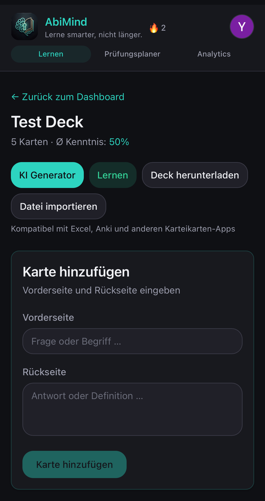
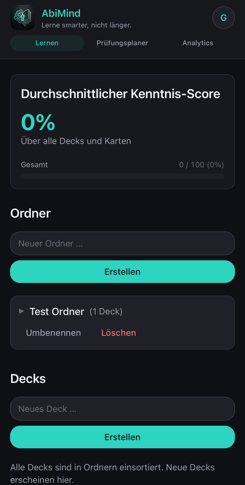
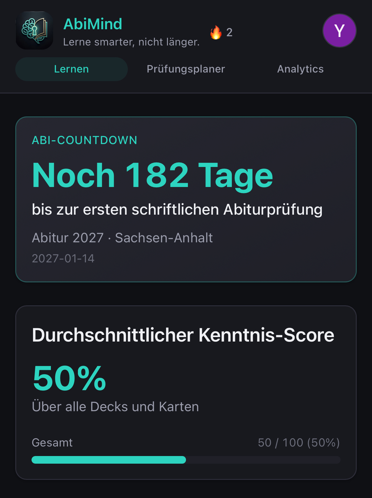
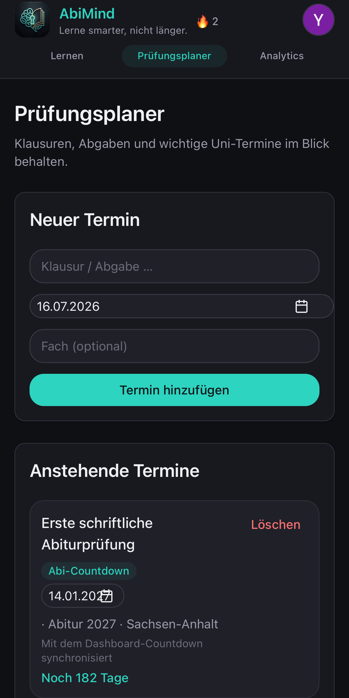
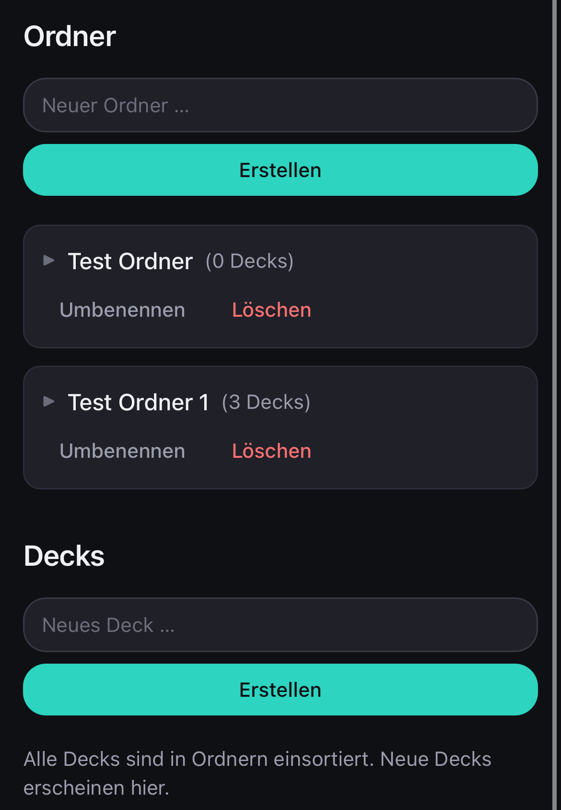
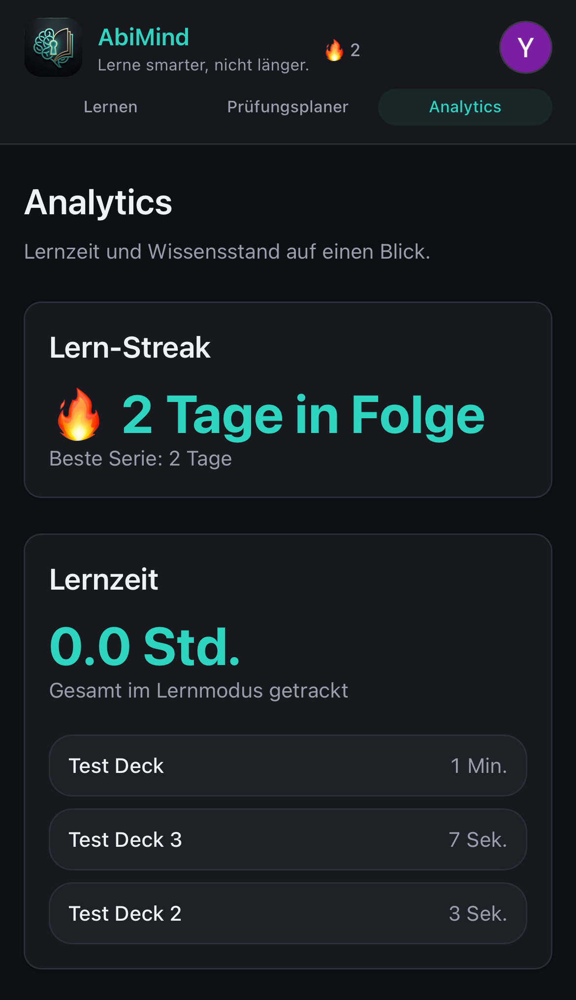
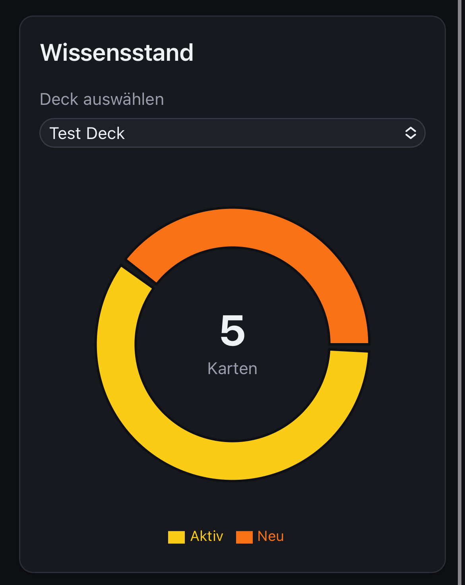
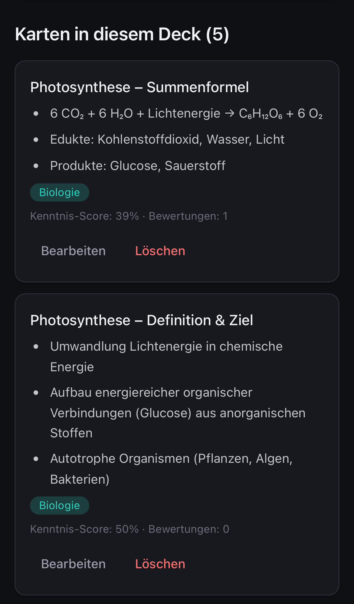

AbiMind
Lerne smarter, nicht länger.
AbiMind ist eine Progressive Web App zur Abitur-Vorbereitung: Karteikarten verwalten, gezielt lernen und mit KI aus Unterlagen neue Karten erzeugen. Die App läuft im Browser, synchronisiert optional in der Cloud und lässt sich auf Handy und Desktop installieren.

[Live Demo](https://abi-mind-swart.vercel.app)

Screenshots:
App-Screenshots & Features
1. Dashboard & Übersicht
Alles Wichtige auf einen Blick: Dein persönlicher Abi-Countdown und der aktuelle durchschnittliche Kenntnis-Score über all deine Decks hinweg.
| Dashboard | Ordner-Verwaltung |
  |  |

2. Strukturierte Lernorganisation
Erstelle Ordner für deine Fächer (wie Biologie oder Mathe) und organisiere deine Decks übersichtlich untereinander – vollkommen mobil-optimiert.


3. Prüfungsplaner & Analytics
Behalte Klausuren, Abgaben und wichtige Termine im Auge und tracke deine exakte Lernzeit sowie deinen exakten Wissensstand pro Deck.
| Prüfungsplaner | Analytics & Lernzeit | Wissensstand |
|  |  |  |

4. Karten-Ansicht & KI-Generator
Füge manuell neue Karteikarten hinzu, importiere vorhandene Dateien oder nutze den integrierten KI-Generator, um blitzschnell neue Lernstapel zu erstellen.
| Deck-Ansicht | Karten-Liste |
|  |  |

5. Intelligenter Lernmodus
Lerne hocheffizient mit dem mobilen 5-Stufen-Bewertungssystem. Jede Bewertung aktualisiert deinen Kenntnis-Score dynamisch im Hintergrund.



---

Features:
- KI-Kartengenerierung — Automatische Karten aus PDF-Text oder Bildern (Google Gemini), mit Duplikat-Prüfung vor dem Speichern
- Gewichteter Lernalgorithmus — Kenntnis-Score (0–100) per exponentiellem Gleitmittel; schwache und neue Karten werden bevorzugt ausgewählt
- 7er-Stapel-Lernmodus — Karten in Batches à 7; schlecht bewertete Karten landen im Wiederholungs-Pool für spätere Stapel
- Kenntnis-Status — Kategorisierung in *Neu*, *Aktiv* und *Beherrscht* (Score ≥ 85) im Analytics-Donut-Chart
- Ordner-Organisation — Decks in Ordnern strukturieren, verschieben und verwalten
- Lernzeit-Tracking — Session-Dauer pro Deck mit Auswertung im Analytics-Dashboard
- Analytics — Gesamtlernzeit, Verteilung nach Deck, Kenntnis-Boxen und Streak-Statistik
- Lern-Streak — Tägliche Lernserie im Header-Badge und in den Analytics
- Prüfungsplaner — Klausuren und Termine planen; Verknüpfung mit Abi-Profil und Countdown-Widget
- Abi-Profil — Abitur-Datum, Fachkombination und Onboarding für personalisierten Countdown
- Google-Login & Gast-Modus — Cloud-Sync über Supabase oder lokale Nutzung ohne Account (IndexedDB)
- Cloud-Sync — Beim ersten Login optional lokale Gast-Daten ins Konto übernehmen
- PWA — Installierbar auf iOS, Android und Desktop; Service Worker für Offline-App-Shell
- CSV Import/Export — Decks als CSV herunterladen oder importieren

---

Tech Stack:
| Bereich | Technologie |
|---------|-------------|
| **Frontend** | [Vite 8](https://vite.dev/) · [React 19](https://react.dev/) · [TypeScript](https://www.typescriptlang.org/) |
| **Styling** | [Tailwind CSS 4](https://tailwindcss.com/) — Dark Theme mit Custom Design Tokens |
| **Lokale Daten** | [Dexie.js](https://dexie.org/) / IndexedDB (Gast-Modus) |
| **Backend & Auth** | [Supabase](https://supabase.com/) — Auth, PostgreSQL, Row Level Security |
| **KI** | [Google Gemini API](https://ai.google.dev/) — Kartengenerierung via Serverless Function |
| **Hosting** | [Vercel](https://vercel.com/) — Static Frontend + `/api`-Functions |
| **PWA** | [vite-plugin-pwa](https://vite-pwa-org.netlify.app/) · Workbox |
| **Charts** | [Recharts](https://recharts.org/) |
| **PDF-Verarbeitung** | [pdf.js](https://mozilla.github.io/pdf.js/) |

---

## Lokale Entwicklung

### Voraussetzungen

- Node.js 20+
- Ein [Supabase-Projekt](https://supabase.com/) (Auth + Datenbank)
- Ein [Google Gemini API-Key](https://aistudio.google.com/apikey)
- Optional: Google OAuth in Supabase aktivieren (für Login)

### Setup

```bash
# 1. Repository klonen
git clone https://github.com/DEIN-USERNAME/Abimind.git
cd Abimind

# 2. Abhängigkeiten installieren
npm install

# 3. Umgebungsvariablen einrichten
cp .env.example .env.local
# Werte in .env.local eintragen (siehe .env.example für alle Keys)

# 4. Supabase-Migrationen ausführen
# SQL-Dateien aus supabase/migrations/ im Supabase SQL Editor ausführen

# 5. Entwicklungsserver starten (Frontend + API)
npm run dev:full
```
**Benötigte Umgebungsvariablen** (Details und Platzhalter in `.env.example`):

| Variable | Zweck |
|----------|--------|
| `GEMINI_API_KEY` | Google Gemini — nur serverseitig |
| `GEMINI_MODEL` | Optional — Modell-Override |
| `VITE_SUPABASE_URL` | Supabase-Projekt-URL |
| `VITE_SUPABASE_ANON_KEY` | Supabase Anon Key |

> **Hinweis:** `GEMINI_API_KEY` darf kein `VITE_`-Prefix haben — sonst würde der Key ins Frontend-Bundle gelangen.

Weitere Scripts: `npm run dev` (nur Frontend), `npm run build`, `npm run preview`, `npm run test`.

---

## Projektstruktur

```
Abimind/
├── api/                  # Vercel Serverless Functions (Gemini)
├── public/               # Manifest, PWA-Icons, statische Assets
├── screenshots/          # README-Screenshots (optional)
├── src/
│   ├── components/       # UI-Komponenten
│   ├── contexts/         # Auth & Abi-Profil
│   └── lib/              # DB, Sync, Lernlogik, Analytics, …
├── supabase/migrations/  # PostgreSQL-Schema
└── vercel.json           # Build- & Routing-Konfiguration
```

---

## Über dieses Projekt

AbiMind ist im Rahmen meiner Portfolio-Vorbereitung für ein **Wirtschaftsinformatik-Studium** entstanden. Ausgangspunkt war ein konkreter eigener Bedarf: strukturierte Abitur-Vorbereitung mit wiederholbarem Lernen, statt unübersichtlicher Zettelstapel und generischer Lern-Apps.

Technisch verbindet das Projekt Frontend-Entwicklung, Datenbankdesign (lokal + cloud), API-Integration und Deployment — von der Idee bis zur installierbaren Web-App.

